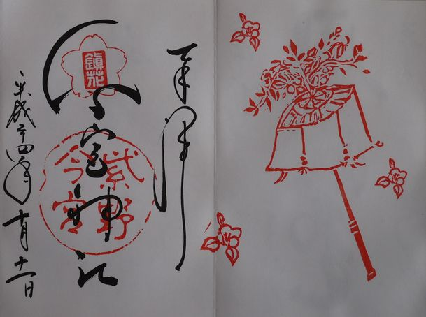

## 取得一覧

| 年     | 日付       | 名            | 場所  |
|--------|------------|---------------|-------|
| 2020年 | 2020/10/18 | 春日大社      | 奈良  |
| 2020年 | 2020/11/22 | 宇佐神宮      | 大分  |
| 2020年 | 2020/12/12 | 明治神宮      | 東京  |
| 2020年 | 2020/12/13 | 渋谷氷川神社  | 東京  |
| 2020年 | 2020/12/28 | 浅草寺        | 東京  |
| 2020年 | 2020/12/31 | 上目黒氷川神社| 東京  |
| 2021年 | 2021/01/01 | 恵比寿神社    | 東京  |
| 2021年 | 2021/01/09 | 代々木八幡宮  | 東京  |
| 2021年 | 2021/01/11 | 池尻稲荷神社  | 東京  |
| 2021年 | 2021/01/16 | 花園神社      | 東京  |
| 2021年 | 2021/07/23 | 温泉寺        | 兵庫  |
| 2021年 | 2021/08/10 | 伊弉諾神宮    | 兵庫  |
| 2021年 | 2021/08/29 | 豊国神社      | 大阪  |
| 2021年 | 2021/10/09 | 生國魂神社    | 大阪  |
| 2021年 | 2021/10/16 | サムハラ神社  | 大阪  |
| 2021年 | 2021/11/30 | 難波神社      | 大阪  |
| 2021年 | 2021/12/31 | 大阪天満宮    | 大阪  |
| 2022年 | 2022/01/01 | 岡田国神社    | 奈良  |
| 2022年 | 2022/05/19 | 三千院        | 京都  |
| 2022年 | 2022/05/19 | 宝泉院        | 京都  |
| 2022年 | 2022/07/24 | 大阪天満宮    | 大阪  |
| 2022年 | 2022/12/10 | 南円堂        | 奈良  |
| 2022年 | 2022/12/25 | 小彦名神社    | 大阪  |
| 2023年 | 2023/02/18 | 石山寺        | 滋賀  |
| 2023年 | 2023/04/02 | 伏見稲荷大社  | 京都  |
| 2023年 | 2023/05/04 | 気比神宮      | 福井  |
| 2023年 | 2023/07/15 | 天橋山智恩寺  | 京都  |
| 2023年 | 2023/07/15 | 元伊勢籠神社  | 京都  |
| 2023年 | 2023/07/24 | 大阪天満宮    | 大阪  |
| 2023年 | 2023/08/12 | 橿原神宮      | 奈良  |
| 2023年 | 2023/08/12 | 大神神社      | 奈良  |
| 2023年 | 2023/09/17 | 伊勢神宮外宮  | 三重  |
| 2023年 | 2023/10/07 | 龍城神社      | 愛知  |
| 2023年 | 2023/10/08 | 熱田神宮      | 愛知  |
| 2023年 | 2023/11/23 | 小彦名神社    | 大阪  |
| 2023年 | 2023/11/24 | 千光寺        | 広島  |
| 2023年 | 2023/11/25 | 大山祇神社    | 愛媛  |
| 2023年 | 2023/12/23 | 因幡堂(平等寺)| 京都  |
| 2024年 | 2024/01/02 | 宇佐神宮      | 大分  |
| 2024年 | 2024/01/07 | 大阪天満宮    | 大阪  |
| 2024年 | 2024/02/24 | 長浜別院大通寺| 滋賀  |
| 2024年 | 2024/00/00 | 八坂神社      | 京都  |
| 2024年 | 2024/00/00 | 安井金比羅宮  | 京都  |
| 2024年 | 2024/05/03 | 多賀大社      | 滋賀  |
| 2024年 | 2024/05/05 | 龍田大社      | 奈良  |
| 2024年 | 2024/05/05 | 廣瀬大社      | 奈良  |
| 2024年 | 2024/05/05 | 大鳥大社      | 大阪  |
| 2024年 | 2024/05/25 | 宗鏡寺（沢庵寺）| 兵庫  |
| 2024年 | 2024/05/25 | 出石神社      | 兵庫  |

## 画像一覧

## 参考一覧

| カテゴリー | 種類  |     | 神社名                         | 所在地              |
|------------|------|-----|-------------------------------|---------------------|
| 二十二社   | 上七社 | △   | 神宮（伊勢神宮）             | 三重県伊勢市       |
| 二十二社   | 上七社 |     | 石清水八幡宮                 | 京都府八幡市       |
| 二十二社   | 上七社 |     | 賀茂別雷神社（上賀茂神社）  | 京都府京都市北区   |
| 二十二社   | 上七社 |     | 賀茂御祖神社（下鴨神社）     | 京都府京都市左京区 |
| 二十二社   | 上七社 |     | 松尾大社                     | 京都府京都市西京区 |
| 二十二社   | 上七社 |     | 平野神社                     | 京都府京都市北区   |
| 二十二社   | 上七社 | 〇   | 伏見稲荷大社                 | 京都府京都市伏見区 |
| 二十二社   | 上七社 | 〇   | 春日大社                     | 奈良県奈良市       |
| 二十二社   | 中七社 |     | 大原野神社                   | 京都府京都市西京区 |
| 二十二社   | 中七社 | 〇   | 大神神社                     | 奈良県桜井市       |
| 二十二社   | 中七社 |     | 石上神宮                     | 奈良県天理市       |
| 二十二社   | 中七社 |     | 大和神社                     | 奈良県天理市       |
| 二十二社   | 中七社 | 〇   | 廣瀬大社                     | 奈良県北葛城郡河合町 |
| 二十二社   | 中七社 | 〇   | 龍田大社                     | 奈良県生駒郡三郷町 |
| 二十二社   | 中七社 |     | 住吉大社                     | 大阪府大阪市住吉区 |
| 二十二社   | 下八社 |     | 日吉大社                     | 滋賀県大津市       |
| 二十二社   | 下八社 |     | 梅宮大社                     | 京都府京都市右京区 |
| 二十二社   | 下八社 |     | 吉田神社                     | 京都府京都市左京区 |
| 二十二社   | 下八社 |     | 廣田神社                     | 兵庫県西宮市       |
| 二十二社   | 下八社 | 〇   | 八坂神社                     | 京都府京都市東山区 |
| 二十二社   | 下八社 |     | 北野天満宮                   | 京都府京都市上京区 |
| 二十二社   | 下八社 |     | 丹生川上神社（中社）         | 奈良県吉野郡東吉野村 |
| 二十二社   | 下八社 |     | 丹生川上神社上社             | 奈良県吉野郡川上村 |
| 二十二社   | 下八社 |     | 丹生川上神社下社             | 奈良県吉野郡下市町 |
| 二十二社   | 下八社 |     | 貴船神社                     | 京都府京都市左京区 |
| 大社       |       |     | 出雲大社                     | 島根県出雲市       |
| 大社       |       |     | 熊野大社                     | 島根県松江市       |
| 大社       |       |     | 三嶋大社                     | 静岡県三島市       |
| 大社       |       |     | 富士山本宮浅間大社           | 静岡県富士宮市     |
| 大社       |       |     | 諏訪大社                     | 長野県諏訪市       |
| 大社       |       |     | 気多大社                     | 石川県羽咋市       |
| 大社       |       |     | 南宮大社                     | 岐阜県不破郡垂井町 |
| 大社       |       |     | 多度大社                     | 三重県桑名市       |
| 大社       |       | 〇   | 多賀大社                     | 滋賀県犬上郡多賀町 |
| 大社       |       |     | 建部大社                     | 滋賀県大津市       |
| 大社       |       |     | 日吉大社                     | 滋賀県大津市       |
| 大社       |       | 〇   | 春日大社                     | 奈良県奈良市       |
| 大社       |       | 〇   | 龍田大社                     | 奈良県生駒郡三郷町 |
| 大社       |       | 〇   | 廣瀬大社                     | 奈良県北葛城郡河合町 |
| 大社       |       | 〇   | 伏見稲荷大社                 | 京都府京都市伏見区 |
| 大社       |       |     | 松尾大社                     | 京都府京都市西京区 |
| 大社       |       |     | 梅宮大社                     | 京都府京都市右京区 |
| 大社       |       |     | 住吉大社                     | 大阪府大阪市住吉区 |
| 大社       |       | 〇   | 大鳥大社                     | 大阪府堺市西区     |
| 大社       |       |     | 熊野本宮大社                 | 和歌山県田辺市     |
| 大社       |       |     | 熊野速玉大社                 | 和歌山県新宮市     |
| 大社       |       |     | 熊野那智大社                 | 和歌山県東牟婁郡那智勝浦町 |
| 大社       |       |     | 宗像大社                     | 福岡県宗像市       |
| 大社       |       |     | 高良大社                     | 福岡県久留米市     |
| 神宮       |       | △   | 神宮（伊勢神宮）             | 三重県伊勢市       |
| 神宮       |       |     | 北海道神宮                   | 北海道札幌市中央区 |
| 神宮       |       | 〇   | 明治神宮                     | 東京都渋谷区       |
| 神宮       |       |     | 香取神宮                     | 千葉県香取市       |
| 神宮       |       |     | 鹿島神宮                     | 茨城県鹿嶋市       |
| 神宮       |       | 〇   | 熱田神宮                     | 愛知県名古屋市熱田区 |
| 神宮       |       | 〇   | 氣比神宮                     | 福井県敦賀市       |
| 神宮       |       |     | 水無瀬神宮                   | 大阪府三島郡島本町 |
| 神宮       |       |     | 白峯神宮                     | 京都府京都市上京区 |
| 神宮       |       |     | 平安神宮                     | 京都府京都市左京区 |
| 神宮       |       |     | 新日吉神宮                   | 京都府京都市東山区 |
| 神宮       |       | 〇   | 橿原神宮                     | 奈良県橿原市       |
| 神宮       |       |     | 吉野神宮                     | 奈良県吉野郡吉野町 |
| 神宮       |       |     | 石上神宮                     | 奈良県天理市       |
| 神宮       |       |     | 國懸神宮                     | 和歌山県和歌山市   |
| 神宮       |       |     | 日前神宮                     | 和歌山県和歌山市   |
| 神宮       |       |     | 近江神宮                     | 滋賀県大津市       |
| 神宮       |       | 〇   | 伊弉諾神宮                   | 兵庫県淡路市       |
| 神宮       |       |     | 赤間神宮                     | 山口県下関市       |
| 神宮       |       |     | 英彦山神宮                   | 福岡県田川郡添田町 |
| 神宮       |       | 〇   | 宇佐神宮                     | 大分県宇佐市       |
| 神宮       |       |     | 宮崎神宮                     | 宮崎県宮崎市       |
| 神宮       |       |     | 鵜戸神宮                     | 宮崎県日南市       |
| 神宮       |       |     | 霧島神宮                     | 鹿児島県霧島市     |
| 神宮       |       |     | 鹿児島神宮                   | 鹿児島県霧島市     |

## 参考一覧（一宮）

| 地方   | 国名 | 種類 | 神社名       | 所在地          |
|--------|------|------|--------------|-----------------|
| 畿内   | 大和 | 〇 | 大神神社     | 奈良県桜井市    |
| 畿内   | 山城 | 　 | 賀茂別雷神社（上賀茂神社）| 京都府京都市北区 |
| 畿内   | 摂津 | 　 | 住吉大社     | 大阪府大阪市住吉区 |
| 畿内   | 河内 | 　 | 枚岡神社     | 大阪府東大阪市  |
| 畿内   | 和泉 | 〇 | 大鳥大社     | 大阪府堺市西区  |
| 畿内   | 近江 | 　 | 建部大社     | 滋賀県大津市    |
| 畿内   | 丹波 | 　 | 出雲大神宮   | 京都府亀岡市    |
| 畿内   | 丹後 | 　 | 籠神社       | 京都府宮津市    |
| 畿内   | 播磨 | 　 | 伊和神社     | 兵庫県宍粟市    |
| 畿内   | 淡路 | 〇 | 伊弉諾神宮   | 兵庫県淡路市    |
| 東海道 | 伊勢 | 　 | 椿大神社     | 三重県鈴鹿市    |
| 東海道 | 尾張 | 　 | 真清田神社   | 愛知県一宮市    |
| 東海道 | 三河 | 　 | 砥鹿神社     | 愛知県豊川市    |
| 東海道 | 遠江 | 　 | 小國神社     | 静岡県周智郡森町|
| 東海道 | 駿河 | 　 | 富士山本宮浅間大社 | 静岡県富士宮市 |
| 東海道 | 伊豆 | 　 | 三嶋大社     | 静岡県三島市    |
| 東海道 | 相模 | 　 | 寒川神社     | 神奈川県高座郡寒川町 |
| 東海道 | 上総 | 　 | 玉前神社     | 千葉県長生郡一宮町 |
| 東海道 | 下総 | 　 | 香取神宮     | 千葉県香取市    |
| 東海道 | 安房 | 　 | 安房神社     | 千葉県館山市    |
| 東山道 | 美濃 | 　 | 南宮大社     | 岐阜県不破郡垂井町 |
| 東山道 | 信濃 | 　 | 諏訪大社     | 長野県諏訪市    |
| 東山道 | 甲斐 | 　 | 浅間神社     | 山梨県笛吹市    |
| 東山道 | 飛騨 | 　 | 水無神社     | 岐阜県高山市    |
| 東山道 | 武蔵 | 　 | 小野神社     | 東京都多摩市    |
| 東山道 | 武蔵 | 　 | 氷川神社     | 埼玉県さいたま市|
| 東山道 | 若狭 | 〇 | 春日大社     | 福井県敦賀市？    |
| 北陸道 | 越前 | 〇 | 氣比神宮     | 福井県敦賀市    |
| 北陸道 | 加賀 | 　 | 白山比咩神社 | 石川県白山市    |
| 北陸道 | 能登 | 　 | 気多大社     | 石川県羽咋市    |
| 北陸道 | 越中 | 　 | 射水神社     | 富山県高岡市    |
| 北陸道 | 越後 | 　 | 弥彦神社     | 新潟県西蒲原郡弥彦村 |
| 北陸道 | 佐渡 | 　 | 度津神社     | 新潟県佐渡市    |
| 北陸道 | 若桜 | 　 | 若狭神社     | 福井県若桜町    |
| 北陸道 | 美濃 | 　 | 春日大社     | 岐阜県美濃市    |
| 北陸道 | 飛騨 | 　 | 飛騨一宮     | 岐阜県高山市    |
| 南海道 | 紀伊 | 　 | 日前神宮・國懸神宮 | 和歌山県和歌山市 |
| 南海道 | 阿波 | 　 | 大麻比古神社 | 徳島県鳴門市    |
| 南海道 | 讃岐 | 　 | 田村神社     | 香川県高松市    |
| 南海道 | 伊予 | 〇 | 大山祇神社   | 愛媛県今治市    |
| 南海道 | 土佐 | 　 | 土佐神社     | 高知県高知市    |
| 西海道 | 豊前 | 〇 | 宇佐神宮     | 大分県宇佐市    |
| 西海道 | 豊後 | 　 | 柞原八幡宮   | 大分県大分市    |
| 西海道 | 筑前 | 　 | 住吉神社     | 福岡県福岡市博多区 |
| 西海道 | 筑後 | 　 | 高良大社     | 福岡県久留米市  |
| 西海道 | 肥前 | 　 | 千栗八幡宮   | 佐賀県三養基郡みやき町 |
| 西海道 | 肥後 | 　 | 阿蘇神社     | 熊本県阿蘇市    |
| 西海道 | 日向 | 　 | 都農神社     | 宮崎県児湯郡都農町 |
| 西海道 | 大隅 | 　 | 鹿児島神宮   | 鹿児島県霧島市  |
| 西海道 | 薩摩 | 　 | 枚聞神社     | 鹿児島県指宿市  |
| 西海道 | 壱岐 | 　 | 天手長男神社 | 長崎県壱岐市    |
| 西海道 | 対馬 | 　 | 海神神社     | 長崎県対馬市    |
| 西海道 | 琉球 | 　 | 波上宮       | 沖縄県那覇市    |
| 西海道 | 筑摩 | 　 | 諏訪大社上社 | 長野県諏訪市    |
| 西海道 | 肥後 | 　 | 阿蘇神社 | 熊本県阿蘇市 |
| 西海道 | 日向 | 　 | 都農神社 | 宮崎県児湯郡都農町 |
| 西海道 | 大隅 | 　 | 鹿児島神宮 | 鹿児島県霧島市 |
| 西海道 | 薩摩 | 　 | 枚聞神社 | 鹿児島県指宿市 |
| 西海道 | 壱岐 | 　 | 天手長男神社 | 長崎県壱岐市 |
| 西海道 | 対馬 | 　 | 海神神社 | 長崎県対馬市 |
| 西海道 | 琉球 | 　 | 波上宮 | 沖縄県那覇市 |

<a href="http://ichinomiya-junpai.jp/img/MAP.png">一宮</a>

京都府
　比叡山
滋賀県
　白髭神社
　近江神宮
　日吉大社
　阿賀神社
　満月寺
　日牟禮八幡宮
和歌山県
　高野山
鳥取県
　大神山神社
　大山寺
　白兎神社
島根県
　城上神社
　足立美術館

